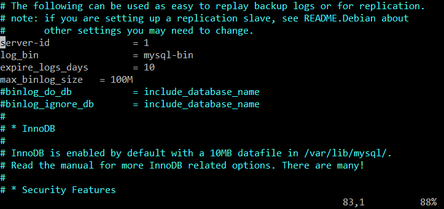
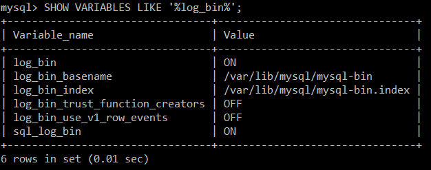

binlog是MySQL产生的二进制日志文件，用于记录mysql的数据更新或者潜在更新，可用于数据备份/恢复/主从复制

# 启用binlog
5.7版本后，通过deb方式直接安装的mysql，可以在/etc/mysql/mysqld.conf.d文件夹中找到mysqld.cnf文件，打开后移动至第83行，取消`server-id`与`log-bin`两项前的注释并进行配置，之后保存重启mysql服务。  

接下来我们登陆mysql的管理程序，执行
```sql
SHOW VARIABLES LIKE '%log_bin%';
```
如果返回信息如下图所示，则表示开启成功。  

# 了解binlog
我们可以通过配置`binlog_do_db`和`binlog_ignore_db`来指定记录/忽略binlog的数据库。对运行中的mysql，也可以直接通过命令`SET SQL_LOG_BIN=1`来进行设置。  
我们执行`SELECT`等不涉及数据更新的语句是不会记binlog的，而涉及到数据更新则会记录。要注意的是，对支持事务的引擎如innodb而言，必须要提交了事务才会记录binlog。  
MySQL提供一个` `参数来控制数据库的binlog的刷新。默认状态下，sync_binlog会是0，也就是不会强制性的将binlog_cache的数据刷新到磁盘上，而是让文件系统决定合适刷新，或cache满后刷新。  
设置`sync_binlog=n`，代表每进行n次事务提交后，MySQL将进行一次fsync之类的磁盘同步指令来将binlog_cache中的数据强制写入磁盘。  
该参数关系着性能/安全性，n越小性能越低，n越大安全性越差，n为0性能最好，但最不安全。  
通过指令`SHOW MASTER LOGS;`可以查看当前binlog数目。
```sql
mysql> SHOW MASTER LOGS;
+------------------+-----------+
| Log_name         | File_size |
+------------------+-----------+
| mysql-bin.000001 |      8022 |
+------------------+-----------+
1 row in set (0.00 sec)
要手动清理binlog可以通过指定binlog名字或者指定保留的日期，命令分别是:`purge master logs to BINLOGNAME;`和`purge master logs before DATE;`
```
可以通过设置`expire_logs_days`来制定binlog保留时间  

# 解析binlog
按照[官方文档](https://dev.mysql.com/doc/internals/en/binary-log-versions.html)的介绍，binlog至今已经存在4个版本，其对应Mysql版本如下：  

- v1: Used in MySQL 3.23
- v3: Used in MySQL 4.0.2 though 4.1
- v4: Used in MySQL 5.0 and up

而v2版本只适用于mysql 4.0.x的某个版本，现在已经不再提供支持。

现在主要使用的mysql已经都是5.0以上版本，在我的项目中已经全部更换5.7版本，所以我们只对v4版本进行一下探究。
binlog是不可读的二进制文件，所以我们需要使用hexdump进行分析。首先我们执行`FLUSH LOGS`指令，生成一个全新的binlog文件，然后分析这个文件的第一个event，也就是format_desc event([了解其他版本请参考官方文档](https://dev.mysql.com/doc/internals/en/binary-log-versions.htm))
```
00000000  fe 62 69 6e 8a 46 3c 5b  0f 01 00 00 00 77 00 00  |.bin.F<[.....w..|
00000010  00 7b 00 00 00 01 00 04  00 35 2e 37 2e 32 32 2d  |.{.......5.7.22-|
00000020  30 75 62 75 6e 74 75 30  2e 31 36 2e 30 34 2e 31  |0ubuntu0.16.04.1|
00000030  2d 6c 6f 67 00 00 00 00  00 00 00 00 00 00 00 00  |-log............|
00000040  00 00 00 00 00 00 00 00  00 00 00 00 00 00 00 13  |................|
00000050  38 0d 00 08 00 12 00 04  04 04 04 12 00 00 5f 00  |8............._.|
00000060  04 1a 08 00 00 00 08 08  08 02 00 00 00 0a 0a 0a  |................|
00000070  2a 2a 00 12 34 00 01 be  a8 33 17 8a 46 3c 5b 23  |**..4....3..F<[#|
00000080  01 00 00 00 1f 00 00 00  9a 00 00 00 80 00 00 00  |................|
00000090  00 00 00 00 00 00 a3 51  fe e6                    |.......Q..|
```
对照一下官方文档中的描述:
```sql
+=====================================+
| event  | timestamp         0 : 4    |
| header +----------------------------+
|        | type_code         4 : 1    | = FORMAT_DESCRIPTION_EVENT = 15
|        +----------------------------+
|        | server_id         5 : 4    |
|        +----------------------------+
|        | event_length      9 : 4    | >= 91
|        +----------------------------+
|        | next_position    13 : 4    |
|        +----------------------------+
|        | flags            17 : 2    |
+=====================================+
| event  | binlog_version   19 : 2    | = 4
| data   +----------------------------+
|        | server_version   21 : 50   |
|        +----------------------------+
|        | create_timestamp 71 : 4    |
|        +----------------------------+
|        | header_length    75 : 1    |
|        +----------------------------+
|        | post-header      76 : n    | = array of n bytes, one byte per event
|        | lengths for all            |   type that the server knows about
|        | event types                |
+=====================================+
```
任何一个v4版本的binlog都会以一个magic number`0xfe62696e`开头(图中蓝框部分),该魔数用utf8解析后代表`bin`三个字母。  
`0xfe62696e`之后，接着的就是`FORMAT_DESCRIPTION_EVENT`。该event中，首先是19个字节长的header。  
**注意：binlog是小端序解读的**  
第一部分是`timestamp`，长度为4个字节，对应数据为`0x 5b 3c 46 8a`，转换为10进制为1530676874，对应`2018-07-04 12:01:14`;  
接下来是一位`type_code`，值为`0x 0f`;  
接下来4个字节代表`server_id`，我设定的`server_id`为1，所以值为`0x 00 00 00 01`;  
接下来是`event_length`，值为`0x 00 00 00 77`;  
接下来是`next_position`，代表下一个event开始的位置，值为`0x 00 00 00 7b`; 
接下来是2个字节的`flags`，值为`0x 00 01`。01代表该binlog还没有关闭，如果关闭了会被设定为00  
这就是一个FORMAT_DESCRIPTION_EVENT的header部分，长度共4+1+4+4+4+2=19个字节  
接下来的部分是FORMAT_DESCRIPTION_EVENT的data部分。  
event的data分为Fixed data和Variable data两部分，其中`Fixed data`是event的固定长度和格式的数据，`Variable data`则是长度变化的数据，比如`format_desc event`的`Fixed data`长度是0x54=84个字节。
data部分的第一个字段是binlog_version，占2个字节，此处的值为`0x 00 04`代表v4版本的binlog  
接下来是50个字节的server_version字段，以UTF-8解析可以得到内容5.7.22-0ubuntu0.16.04.1-log，与我们执行SELECT version()得到的版本号一直。  
接下来4个字节是binlog创建时的时间戳，此处为0;
接下啦的1个字节是header_length，值为0x13，代表之后所有event的公共头长度，这里都是19


```

```

