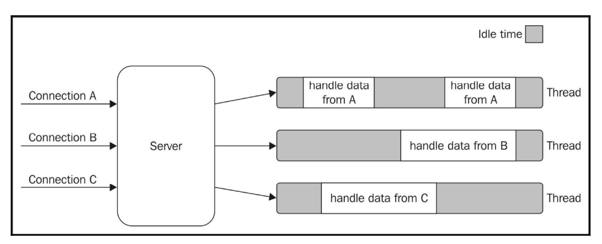
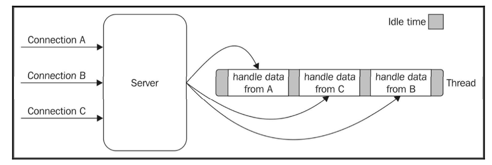
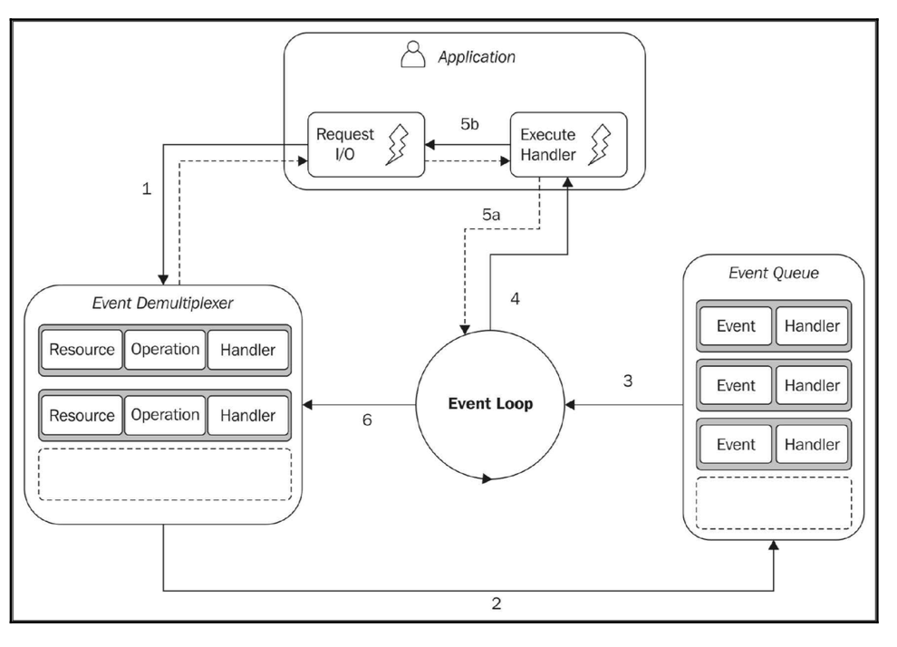

# Chapter 1:Welcome to the Node.js Platfor

## NodeJS的设计哲学
### 精简核心
 Node自身的核心库小而精，而其生态系统存在于核心库之外，有利于实验更多的解决方案与快速迭代。
### 精简模块
 在Node中，一个重要原则是设计小模块，一个小模块是指满足一下特征的模块
    * 易于理解和使用
    * 易于测试和维护
    * 完美与浏览器共享

 DRY原则-`Don't Repet Yourself`

### 精简接口
每个Node.js模块都是一个函数（类也是以构造函数的形式呈现），我们只需要调用相关API即可，而不需要知道其它模块的实现。Node.js模块是为了使用它们而创建，不仅仅是在拓展性上，更要考虑到维护性和可用性。

### 简单实用

> Simplicity is the ultimate sophistication.  
> KISS - Keep It Simple, Stupid.

## 认识Nodejs6与ES2015
编码时请使用严格模式  
```js
'use strict'
```
### let与const
`ES2015`之前，JS只有函数和全局作用域，这意味着，你在某个作用于内部生命的变量，在外部也是可以访问的，虽然会造成不可预料的后果。  
示例代码：
```js
if(false){
    var x = 'hello';
}
console.log(x)
//输出undefined
```
而到了`ES2015`，我们引入了`let`关键字来生命遵守块作用域的变量，还是上面的代码，假设我们把
```js
var x = 'hello';
```
中的`var`换位`let`，那么这段代码就会产生错误。我们执行一下得到下列结果:
```
console.log(x)
            ^
ReferenceError: x is not defined
```
OK，酷炫  
`let`这种保护性描述会迫使我们编写更安全的代码(虽然在其他语言里这是很基础的特性)

`ES2015`中还引入了`const`关键字，该关键字用于定义常量。
```js
const x = 'this will never change';
x = 'change';
```
顺利报错
```
x = 'change';
  ^
TypeError: Assignment to constant variable.
```
需要注意的是，这里的const并不意味着*值是不变的*，而是指*该值的引用是静态的*，下面的代码就是正确的。
```js
const x = {};
x.name = 'John';
```
没错，在进行这个赋值操作时，我们并未改变x与其内部成员之间的绑定关系，因此是正确的；而假设我们直接给x赋值，如`x = null`这种用法，那就会产生错误。  
实际运用中，我们使用const引入模块，防止意外被更改：
```js
const path = require('path');
let path = './some/path';
```
那么如何创建一个不可变对象呢？请参考`Object.freeze()`。

### 箭头函数
箭头函数是一种简洁定义函数的语法(糖)，箭头函数更易于理解，特别是在我们定义回调的时候：
```js
const numbers = [2,6,7,8,1];
const even = numbers.filter(function(x) {
    return x%2 === 0;
});
```
箭头函数写法
```
const numbers = [2,6,7,8,1];
const even = numbers.filter(x => x%2 === 0);
```
以上其实是只有一个参数，并且只有一句返回语句的简略写法，其实标准的箭头函数如果没有参数传递/有多个参数传递，必须要将参数用括号包裹，同时语句也必须用大括号包裹，并且显式的调用`return`语句
```js
const numbers = [1,2,3,4,5];
const even = numbers.filter(x => {
    if (x%2===0){
        console.log(x + ' is even');
        return true;
    }
});
```
箭头函数的另一个重要特性是：箭头函数是绑定到它们的词法作用域内的。这意味着一个箭头函数中this的值和父块中是相同的。例子如下：
```js
function DelayedGreeter(name) {
  this.name = name;
}
DelayedGreeter.prototype.greet = function() {
  setTimeout(function cb() {
    console.log('Hello' + this.name);
  }, 500);
}
const greeter = new DelayedGreeter('World');
greeter.greet(); // 'Helloundefined'
```
为什么会输出`Helloundefined`？原因是在函数cb()和方法greet()中this的作用域不一样，cb中无法取得外部的name变量，传统的解决方法是使用bind()
```js
setTimeout( (function cb() {
    console.log('Hello' + this.name);
  }).bind(this), 500);
```
使用箭头函数就可以这样写：
```js
setTimeout(() => console.log('Hello' + this.name), 500);
```

## 类语法糖
ES2015引入了针对原型继承的语法糖`class`，这样可以使刚接触Node/使用过其他语言的开发者感到更加亲切，同时也使代码更加方便易读。
需要注意的是，该语法糖不会改变JS本身的继承特征。
一个简单的例子：
```js
//传统的构造器+原型的写法
function Person(name, surname, age) {
  this.name = name;
  this.surname = surname;
  this.age = age;
}

Person.prototype.getFullName = function() {
  return this.name + '' + this.surname;
}

Person.older = function(person1, person2) {
  return (person1.age >= person2.age) ? person1 : person2;
}
```
在该例程中，一个`Person`有`name`, `surname`, `age`三个参数，我们编写了一个原型辅助函数`getFullName()`，它调用辅助函数`older()`来实现输出两个`Person`中`age`较大者`name`的功能。
而使用新语法糖`class`后……
```js
class Person{
    constructor(name, surname, age){
        this.name = name;
        this.surname = surname;
        this.age = age;
    }
    getFullname(){
        return this.name + ' ' + this.surname;
    }
    static older (person1,person2){
        return (person1.age >= person2.age) ? person1 : person2;
    }
}
```
Surprise!是不是感觉不是在写JS而是在写Java？别着急，还有extend关键字和super关键字呢。
```js
class PersonWithMiddlename extends Person {
  constructor(name, middlename, surname, age) {
    super(name, surname, age);
    this.middlename = middlename;
  }

  getFullName() {
    return this.name + '' + this.middlename + '' + this.surname;
  }
}
```
……我真的不是在写Java？

## 对象字面量的新语法
有时候我们需要将一些已经被定义的变量(或常量)作为其他对象字面量的属性值进行返回或传入操作，而大多数情况下这些变量名和属性名都是相同的，我们可以对属性名定义进行省略。
```js
const x = 22;
const y = 17;
const obj = { x, y };
```
函数类属性的省略语法
```js
module.exports = {
  square(x) {
    return x * x;
  },
  cube(x) {
    return x * x * x;
  },
};
```
可动态计算的属性名
```js
const namespace = '-webkit-';
const style = {
  [namespace + 'box-sizing']: 'border-box',
  [namespace + 'box-shadow']: '10px 10px 5px #888',
};
console.log(style);
```
输出结果
```bash
{     '-webkit-box-sizing': 'border-box',
    '-webkit-box-shadow': '10px 10px 5px #888' }
```
新的定义getter和setter方式
```js
const person = {
  name: 'George',
  surname: 'Boole',

  get fullname() {
    return this.name + ' ' + this.surname;
  },

  set fullname(fullname) {
    let parts = fullname.split(' ');
    this.name = parts[0];
    this.surname = parts[1];
  }
};

console.log(person.fullname); // "George Boole"
console.log(person.fullname = 'Alan Turing'); // "Alan Turing"
console.log(person.name); // "Alan"
```
这里，第二个`console.log`触发了`set`方法。

## Map与Set集合
```js
const profile = new Map();
profile.set('weibo','@richXXwang');
profile.set('qq','522637XX2');
profile.set('wechat','yxxx610');
profile.size;
console.log(profile.has('weibo'));
console.log(profile.get('weibo'));
console.log(profile.has('RTX'));
console.log(profile.get('qq'));
console.log(profile.delete('qq'));
console.log(profile.has('qq'));
console.log(profile.get('qq'));
for(const entry of profile){
    console.log(entry);
}
```
输出结果
```bash
true
@richXXwang
false
522637XX2
true
false
undefined
[ 'weibo', '@richXXwang' ]
[ 'wechat', 'yxxx610' ]
```
更多的关于Map的使用方法，可查阅[官方手册](https://developer.mozilla.org/zh-CN/docs/Web/JavaScript/Reference/Global_Objects/Map)  
除了Map之外，ES2015还引入了Set原型。这个原型可以用于轻松构建集合，一个所有值都唯一的列表：
```js
const s = new Set( [0,1,2,3]);
s.add(3);
console.log(s.size);
s.delete(0);
console.log(s.size);
console.log(s.has(2));
for(const entry of s){
  console.log(entry);
}
```
## WeakMap与WeakSet集合
### [WeakMap](https://developer.mozilla.org/zh-CN/docs/Web/JavaScript/Reference/Global_Objects/WeakMap)
### [WeakSet](https://developer.mozilla.org/en-US/docs/Web/JavaScript/Reference/Global_Objects/WeakSet)

## 模板字符串
### [参考文档](https://developer.mozilla.org/zh-CN/docs/Web/JavaScript/Reference/template_strings)

## 其他ES2015特性
* [Default function parameters](https://developer.mozilla.org/zh-CN/docs/Web/JavaScript/Reference/Functions/Default_parameters)
* [Rest parameters](https://developer.mozilla.org/zh-CN/docs/Web/JavaScript/Reference/Functions/Rest_parameters)
* [Spread operator](https://developer.mozilla.org/zh-CN/docs/Web/JavaScript/Reference/Operators/Spread_operator)
* [Destructuring](https://developer.mozilla.org/zh-CN/docs/Web/JavaScript/Reference/Operators/Destructuring_assignment)
* [`new.target`](https://developer.mozilla.org/zh-CN/docs/Web/JavaScript/Reference/Operators/new.target)
* [Proxy](https://developer.mozilla.org/zh-CN/docs/Web/JavaScript/Reference/Global_Objects/Proxy)
* [Reflect](https://developer.mozilla.org/zh-CN/docs/Web/JavaScript/Reference/Global_Objects/Reflect)
* [Symbols](https://developer.mozilla.org/zh-CN/docs/Glossary/Symbol)

## Reactor模式
Reactor模式是Node异步特性的核心，为什么要使用Reactor模式？
### I/O是缓慢的
首先我们要明确这个概念，`I/O`是计算机基本操作中最慢的一个操作。
### 阻塞I/O
以下内容翻译自原文：
> 在一个阻塞`I/O`模型的进程中，`I/O`请求会阻塞之后代码块的运行。在`I/O`请求操作完成之前，线程会有一段不定长的时间浪费。（它可能是毫秒级的，但甚至有可能是分钟级的，如用户按着一个按键不放的情况）。以下例子就是一个阻塞`I/O`模型。
```js
// 直到请求完成，数据可用，线程都是阻塞的
data = socket.read();
// 请求完成，数据可用
print(data);
```
> 我们知道，阻塞I/O的服务器模型并不能在一个线程中处理多个连接，每次I/O都会阻塞其它连接的处理。出于这个原因，对于每个需要处理的并发连接，传统的web服务器的处理方式是新开一个新的进程或线程（或者从线程池中重用一个进程）。这样，当一个线程因 I/O操作被阻塞时，它并不会影响另一个线程的可用性，因为他们是在彼此独立的线程中处理的。  
> 通过下面这张图：  

> 通过上面的图片我们可以看到每个线程都有一段时间处于空闲等待状态，等待从关联连接接收新数据。如果所有种类的I/O操作都会阻塞后续请求。例如，连接数据库和访问文件系统，现在我们能很快知晓一个线程需要因等待I/O操作的结果等待许多时间。不幸的是，一个线程所持有的CPU资源并不廉价，它需要消耗内存、造成CPU上下文切换，因此，长期占有CPU而大部分时间并没有使用的线程，在资源利用率上考虑，并不是高效的选择。

### 非阻塞I/O

> 除阻塞`I/O`之外，大部分现代的操作系统支持另外一种访问资源的机制，即非阻塞`I/O`。在这种机制下，后续代码块不会等到`I/O`请求数据的返回之后再执行。如果当前时刻所有数据都不可用，函数会先返回预先定义的常量值(如`undefined`)，表明当前时刻暂无数据可用。

> 例如，在`Unix`操作系统中，`fcntl()`函数操作一个已存在的文件描述符，改变其操作模式为非阻塞`I/O`(通过`O_NONBLOCK`状态字)。一旦资源是非阻塞模式，如果读取文件操作没有可读取的数据,或者如果写文件操作被阻塞,读操作或写操作返回-1和`EAGAIN`错误。

> 非阻塞`I/O`最基本的模式是通过轮询获取数据，这也叫做`*忙碌-等待*模型`。看下面这个例子，通过非阻塞`I/O`和轮询机制获取`I/O`的结果。

参考一个简单例子：
```js
resources = [socketA, socketB, pipeA];
while(!resources.isEmpty()) {
  for (i = 0; i < resources.length; i++) {
    resource = resources[i];
    // 进行读操作
    let data = resource.read();
    if (data === NO_DATA_AVAILABLE) {
      // 此时还没有数据
      continue;
    }
    if (data === RESOURCE_CLOSED) {
      // 资源被释放，从队列中移除该链接
      resources.remove(i);
    } else {
      consumeData(data);
    }
  }
}
```
> 在该伪代码中，已经可以在同一个线程中处理不同的资源，但是它效率仍然不高。事实上，在前面的示例中，循环仅消耗宝贵的CPU时间对多数时间不可用的资源进行迭代。轮训算法会导致大量的CPU时间浪费。

### 事件多路复用
> 对于获取非阻塞的资源而言，`*忙碌-等待*模型`不是一个理想的技术。但是幸运的是，大多数现代的操作系统提供了一个原生的机制来处理并发，非阻塞资源（*同步事件多路复用器*）是一个有效的方法。这种机制被称作*事件循环机制*，这种事件收集和`I/O`队列源于*发布-订阅*模式。事件多路复用器收集资源的`I/O`事件并且把这些事件放入队列中，直到事件被处理时都是阻塞状态。看下面这个伪代码：
```js
socketA, pipeB;
wachedList.add(socketA, FOR_READ);
wachedList.add(pipeB, FOR_READ);
while(events = demultiplexer.watch(wachedList)) {
  // 事件循环
  foreach(event in events) {
    // 这里并不会阻塞，并且总会有返回值（不管是不是确切的值）
    data = event.resource.read();
    if (data === RESOURCE_CLOSED) {
      // 资源已经被释放，从观察者队列移除
      demultiplexer.unwatch(event.resource);
    } else {
      // 成功拿到资源，放入缓冲池
      consumeData(data);
    }
  }
}
```
> 事件多路复用的三个步骤：
> 1. 资源被添加到一个数据结构中，为每个资源关联一个特定的操作，在这个例子中是read。
> 2. 事件通知器由一组被观察的资源组成，一旦事件即将触发，会调用同步的watch函数，并返回这个可被处理的事件。
> 3. 最后，处理事件多路复用器返回的每个事件，此时，与系统资源相关联的事件将被读并且在整个操作中都是非阻塞的。直到所有事件都被处理完时，事件多路复用器会再次阻塞，然后重复这个步骤，以上就是`event loop`。

在这种模式下，可以做到单个线程内处理多个IO操作，而无需使用*忙碌-等待*技术，下面是一张示意图：

> 上图可以很好的帮助我们理解在一个单线程的应用程序中使用同步的时间多路复用器和非阻塞I/O实现并发。我们能够看到，只使用一个线程并不会影响我们处理多个I/O任务的性能。同时，我们看到任务是在单个线程中随着时间的推移而展开的，而不是分散在多个线程中。我们看到，在单线程中传播的任务相对于多线程中传播的任务反而节约了线程的总体空闲时间，并且更利于程序员编写代码。在这本书中，你可以看到我们可以用更简单的并发策略，因为不需要考虑多线程的互斥和同步问题。

> 在下一章中，我们有更多机会讨论Node.js的并发模型。

### Reactor模式简介
> 现在来说`reactor`模式，它通过一种特殊的算法设计的处理程序（在Node中是使用一个回调函数表示），一旦事件产生并在事件循环中被处理，那么相关`handler`将会被调用。
它的结构如图所示：

reactor模式的步骤为：

1. 应用程序通过提交请求到时间多路复用器产生一个新的`I/O`操作。应用程序指定`handler`，`handler` 在操作完成后被调用。提交请求到事件多路复用器是非阻塞的，其调用所以会立马返回，将执行权返回给应用程序。
2. 当一组I/O操作完成，事件多路复用器会将这些新事件添加到事件循环队列中。
3. 此时，事件循环会迭代事件循环队列中的每个事件。
4. 对于每个事件，对应的`handler`被处理。
5. `handler`，是应用程序代码的一部分，`handler`执行结束后执行权会交回事件循环。但是，在`handler` 执行时可能请求新的异步操作，从而新的操作被添加到事件多路复用器。
6. 当事件循环队列的全部事件被处理完后，循环会在事件多路复用器再次阻塞直到有一个新的事件可处理触发下一次循环。
我们现在可以定义Node的核心模式：
> 模式(反应器)阻塞处理`I/O`到在一组观察的资源有新的事件可处理，然后以分派每个事件对应`handler`的方式反应。

### Node.js-libuv的非阻塞IO引擎
每个操作系统对于事件多路复用器有其自身的接口，Linux是`epoll`，Mac OSX是`kqueue`，Windows的`IOCP API`。除外，即使在相同的操作系统中，每个I/O操作对于不同的资源表现不一样。例如，在Unix下，普通文件系统不支持非阻塞操作，所以，为了模拟非阻塞行为，需要使用在事件循环外用一个独立的线程。  
所有这些平台内和跨平台的不一致性需要在事件多路复用器的上层做抽象。这就是为什么Node.js为了兼容所有主流平台而 编写C语言库libuv，目的就是为了使得Node.js兼容所有主流平台和规范化不同类型资源的非阻塞行为。libuv今天作为Node.js的`I/O`引擎的底层。