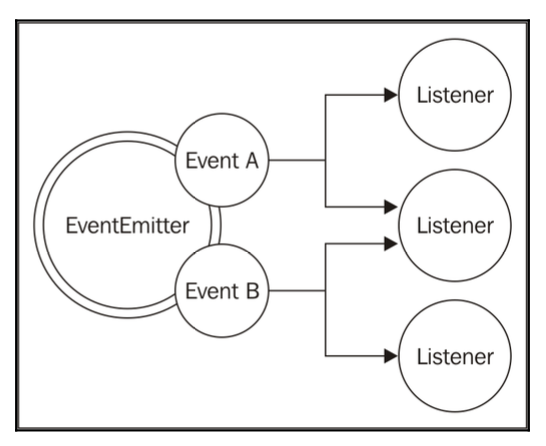

# Chapter 2: Node.js Essential Patterns
本章介绍了Node最核心的两种设计模式-`回调(callback)`与`事件触发器(eventemitter)`;

## 回调模式
回调模式是实现Reactor模式的实现，也是Node独特变成风格的印记。  
在本节中，我们分析基于回调的编程思想和模式，而不是同步操作的返回指令的模式。  

### CPS(Continuation Passing Style)
在JavaScript中，回调函数作为参数传递给另一个函数，并在操作完成时调用。在函数式编程中，这种传递结果的方法被称为CPS。这是一个通用的概念，它并不总是与异步操作相关联，事实上它只表示通过将结果传递给另一个函数(函数)而使结果得到传递，而不是直接返回给调用者。
#### 同步CPS与异步CPS
同步：
```js
//这是一个同步的add函数
function add(a,b){
    return a+b;
}
//这是一个等效后的CPS函数
function add(a,b,callback){
    callback(a+b);
}
//这是对该CPS的调用
console.log('before');
add(1,2,ans = > console.log('result:'+ ans));
console.log('after');
```
因为add()函数是同步的，所以结果如下：
```
before
result:3
after
```
我们分析一下程序运行的流程，首先输出before，然后传递`1,2`给匿名回调函数`ans()`，等待`ans()`计算完成再退栈到`add()`,最后输出after，非常传统的流程。
OK接下来我们看一下异步CPS是怎样的
```js
//使用setTimeout()模拟回调的异步调用
function addAsync(a,b,callback){
  setTimeout(()=>callback(a+b),100);
}
```
输出结果
```
before
after
result:3
```
由于setTimeout()触发了异步操作，它不会等待需要执行的回调而是立刻返回执行后面的语句，也就是说回到addAsync()，然后再返回到主程序中，所以`before`与`after`会先于`result:3`被输出。  
看起来这个回调好像是和主线程并行执行的，如果我们把setTimeout()中的数字改小一些呢？  
答案是没有用的，Reactor模式虽然能实现“看起来是并行”的效果，但是本质还是在串行执行，而callback的内容是由时间循环来执行的，下面这张图解释来程序的执行过程：

当异步操作完成时，执行权就会交给这个异步操作开始的地方，即回调函数。执行将从*事件循环*开始，所以它将有一个新的堆栈。对于JavaScript而言，这是它的优势所在。正是由于闭包保存了其上下文环境，即使在不同的时间点和不同的位置调用回调，也能够正常地执行。

同步函数在其完成操作之前是阻塞的。而异步函数立即返回，结果将在事件循环的稍后循环中传递给处理程序（在我们的例子中是一个回调）。

#### 非CPS回调
某些情况下情况下，我们可能会认为回调CPS式的写法像是异步的，然而并不是。比如以下代码，`Array`对象的`map()`方法：
```js
const result = [1, 5, 7].map(element => element - 1);
console.log(result); // [0, 4, 6]
```
在上述例子中，回调仅用于迭代数组的元素，而不是传递操作的结果。实际上，这个例子中是使用回调的方式同步返回，而非传递结果。是否是传递操作结果的回调通常在API文档有明确说明。
### 同步还是异步
同步/异步编程模式不同会对代码产生不同的影响，体现在开发/调试的各个阶段。下面我们分析一下不同模式所带来的陷阱。
#### 不可预测的函数
```js
const fs = require('fs');
const cache = {};

function inconsistentRead(filename, callback) {
  if (cache[filename]) {
    // 如果缓存命中，则同步执行回调
    callback(cache[filename]);
  } else {
    // 未命中，则执行异步非阻塞的I/O操作
    fs.readFile(filename, 'utf8', (err, data) => {
      cache[filename] = data;
      callback(data);
    });
  }
}
```
这段代码中，同一个API既有可能在同步模式下运行，也有可能在一步模式下运行。  
这个函数是危险的，因为如果没有设置高速缓存，它的行为是异步的，直到`fs.readFile()`函数返回结果为止，它都不会同步执行，这时缓存并不会触发，而会去走异步回调调用。
#### 解放[Zalgo](https://github.com/oren/oren.github.io/blob/master/posts/zalgo.md)
关于`zalgo`，其实就是指同步或异步行为的不确定性，几乎总是导致非常难追踪的`bug`。
举个例子：
```js
function createFileReader(filename) {
  const listeners = [];
  inconsistentRead(filename, value => {
    listeners.forEach(listener => listener(value));
  });
  return {
    onDataReady: listener => listeners.push(listener)
  };
}
```
这段代码使用了前文中的inconsistentRead()实现了createFileReader()，接下来我们尝试使用createFileReader()函数
```js
const reader1 = createFileReader('data.txt');
reader1.onDataReady(data => {
 console.log('First call data: ' + data);
 // 之后再次通过fs读取同一个文件
 const reader2 = createFileReader('data.txt');
 reader2.onDataReady(data => {
   console.log('Second call data: ' + data);
 });
});
```
我们把所有代码保存在一个文件中，并在同目录创建一个`data.txt`的文件，文件中只有一句`hello world`，然后我们执行`node main.js`，获得如下结果：
```bash
$ node main.js
First call data: hello
```
所以为什么只有一次调用，第二次去哪儿了？  
* 在创建`reader1`的时候，`inconsistentRead()`函数是异步执行的，这时没有可用的缓存结果，因此我们有时间注册事件监听器。在读操作完成后，它将在下一次事件循环中被调用。
* 然后，在事件循环的循环中创建`reader2`，其中所请求文件的缓存已经存在。在这种情况下，内部调用`inconsistentRead()`将是同步的。所以，它的回调将被立即调用，这意味着`reader2`的所有监听器也将被同步调用。然而，在创建`reader2`之后，我们才开始注册监听器，所以它们将永远不被调用。
* `inconsistentRead()`回调函数的行为是不可预测的，因为它取决于许多因素，例如调用的频率，作为参数传递的文件名，以及加载文件所花费的时间等。
#### 使用同步API
通过上述示例，我们得到一个结论：  
> API必须明确定义其特性-同步或者异步  
必须正确评估应用场景，选择最合适的I/O方案  
注意，只有不影响程序并发能力时，才考虑使用同步阻塞I/O  
#### 延迟执行
是一种解决上面代码问题的手段，可以使`inconsistentRead()`函数变成完全异步的
```js
if (cache[filename]) {
    // 如果缓存命中，则同步执行回调
    callback(cache[filename]);
  }
/////////////////////////////
if (cache[filename]) {
    // 下一次事件循环立即调用
    process.nextTick(() => callback(cache[filename]));
  }
```

### Node.js回调约定
在Node中，CPS的API和回调遵守一组特定的约定，我们在编写API时也应遵守。
* 回调函数是最后一个参数
* 异常处理放在最前面
* 异常传递到下一个回调
* 收到未捕获异常退出程序

## 模块系统及模式

JavaScript的主要问题之一是没有命名空间。在全局范围内运行的程序会污染全局命名空间，造成相关变量、数据、方法名的冲突。解决这个问题的技术称为模块模式，看下列代码：

```js
const module = (() => {
  const privateFoo = () => {
    // ...
  };
  const privateBar = [];
  const exported = {
    publicFoo: () => {
      // ...
    },
    publicBar: () => {
      // ...
    }
  };
  return exported;
})();
console.log(module);
```
此模式利用自执行匿名函数实现模块，仅导出旨希望被公开调用的部分。在上面的代码中，模块变量只包含导出的API，而其余的模块内容实际上从外部访问不到。我们将在稍后看到，这种模式背后的想法被用作Node.js模块系统的基础。

### 自定义模块系统
```js
function loadModule(filename, module, require) {
  const wrappedSrc = `(function(module, exports, require) {
         ${fs.readFileSync(filename, 'utf8')}
       })(module, module.exports, require);`;
  eval(wrappedSrc);
}
const require = (moduleName) => {
  console.log(`Require invoked for module: ${moduleName}`);
  const id = require.resolve(moduleName);
  // 是否命中缓存
  if (require.cache[id]) {
    return require.cache[id].exports;
  }
  // 定义module
  const module = {
    exports: {},
    id: id
  };
  // 新模块引入，存入缓存
  require.cache[id] = module;
  // 加载模块
  loadModule(id, module, require);
  // 返回导出的变量
  return module.exports;
};
require.cache = {};
require.resolve = (moduleName) => {
  /* 通过模块名作为参数resolve一个完整的模块 */
};
```
上面的函数模拟了用于加载模块的原生`Node.js`的`require()`函数的行为。当然，这只是一个`demo`，它并不能准确且完整地反映`require()`函数的真实行为，但是为了更好地理解`Node.js`模块系统的内部实现，定义模块和加载模块。我们的自制模块系统的功能如下：

- 模块名称被作为参数传入，我们首先做的是找寻模块的完整路径，我们称之为id。`require.resolve()`专门负责这项功能，它通过一个特定的解析算法实现相关功能（稍后将讨论）。
- 如果模块已经被加载，它应该存在于缓存。在这种情况下，我们立即返回缓存中的模块。
- 如果模块尚未加载，我们将首次加载该模块。创建一个模块对象，其中包含一个使用空对象字面值初始化的`exports`属性。该属性将被模块的代码用于导出该模块的公共API。
- 缓存首次加载的模块对象。
- 模块源代码从其文件中读取，代码被导入，如前所述。我们通过`require()`函数向模块提供我们刚刚创建的模块对象。该模块通过操作或替换`module.exports`对象来导出其公共`API`。
- 最后，将代表模块的公共`API`的`module.exports`的内容返回给调用者。

#### 定义模块

```js
// 加载另一个模块
const dependency = require('./anotherModule');
// 模块内的私有函数
function log() {
  console.log(`Well done ${dependency.username}`);
}
// 通过导出API实现共有方法
module.exports.run = () => {
  log();
};
```
需要注意的是模块内的所有内容都是私有的，除非它被分配给`module.exports`变量。然后，当使用`require()`加载模块时，缓存并返回此变量的内容。

#### 定义全局变量

模块系统公开了一个名为`global`的特殊变量。分配给此变量的所有内容将会被定义到全局环境下。

#### module.exports & exports
每一个node.js执行文件，都自动创建一个`module`对象，同时，`module`对象会创建一个叫`exports`的属性，初始化的值是` {}`  
变量`export`只是对`module.exports`的初始值的引用;我们已经看到，`exports`本质上在模块加载之前只是一个简单的对象。  
重新给`exports`赋值并不会有任何影响，因为它并不会因此而改变`module.exports`的内容，它只是改变了该变量本身。

#### require()是一个同步函数
因此它应该放在所有逻辑前面  

#### resolve算法
[resolve算法的文档](https://nodejs.org/api/modules.html#modules_all_together)

#### 模块缓存
每个模块只会在它第一次引入的时候加载，此后的任意一次`require()`调用均从之前缓存的版本中取得。  

#### 循环依赖
为了防止模块载入的死循环，`Node.js`在模块第一次载入后会把它的结果进行缓存，下一次再对它进行载入的时候会直接从缓存中取出结果。所以在这种循环依赖情形下，不会有死循环，但是却会因为缓存造成模块没有按照我们预想的那样被导出

### 模块定义模式
#### 命名导出
```js
//file logger.js
exports.info = (message) => {
  console.log('info: ' + message);
};
exports.verbose = (message) => {
  console.log('verbose: ' + message);
};
// file main.js
const logger = require('./logger');
logger.info('This is an informational message');
logger.verbose('This is a verbose message');
```
大多数`Node.js`模块使用这种定义
#### 函数导出
将整个`module.exports`变量重新分配给一个函数。它的主要优点是它只暴露了一个函数，为模块提供了一个明确的入口点，使其更易于理解和使用，它也很好地展现了单一职责原则。这种定义模块的方法在社区中也被称为`substack`模式，在以下示例中查看此模式：
```js
// file logger.js
module.exports = (message) => {
  console.log(`info: ${message}`);
};
//这种方法还允许我们公开具有次要或更高级用例的其他函数
module.exports.verbose = (message) => {
  console.log(`verbose: ${message}`);
};
//调用
// file main.js
const logger = require('./logger');
logger('This is an informational message');
logger.verbose('This is a verbose message');
```
`Node.js`的模块化鼓励我们遵循采用单一职责原则（`SRP`）：每个模块应该对单个功能负责，该职责应完全由该模块封装，以保证复用性

#### 构造器导出
导出构造函数的模块是导出函数的模块的特例。其不同之处在于，使用这种新模式，我们允许用户使用构造函数创建新的实例，但是我们也可以扩展其原型并创建新类（继承）。
```js
// file logger.js
function Logger(name) {
  this.name = name;
}
Logger.prototype.log = function(message) {
  console.log(`[${this.name}] ${message}`);
};
Logger.prototype.info = function(message) {
  this.log(`info: ${message}`);
};
Logger.prototype.verbose = function(message) {
  this.log(`verbose: ${message}`);
};
module.exports = Logger;
// file main.js
const Logger = require('./logger');
const dbLogger = new Logger('DB');
dbLogger.info('This is an informational message');
const accessLogger = new Logger('ACCESS');
accessLogger.verbose('This is a verbose message');
```
通过ES2015的`class`关键字语法也可以实现相同的模式：
```js
class Logger {
  constructor(name) {
    this.name = name;
  }
  log(message) {
    console.log(`[${this.name}] ${message}`);
  }
  info(message) {
    this.log(`info: ${message}`);
  }
  verbose(message) {
    this.log(`verbose: ${message}`);
  }
}
module.exports = Logger;
```
导出构造函数或类仍然为模块提供单个入口点，但是与`substack`模式相比，它暴露了更多内部细节，另一方面它也有了更强的扩展性。  
这种模式的差异包括应用防止不适用`new`指令调用的防护。这个小技巧允许吧模块作为工厂`(factory)`使用：
```js
function Logger(name) {
  if (!(this instanceof Logger)) {
    return new Logger(name);
  }
  this.name = name;
};
```
诀窍很简单：检查this是否存在并且是logger的一个实例，如果不是，则意味着Logger()函数被调用但是未使用new，然后继续创建新实例并返回给调用者。这种技术允许我们将模块也用作工厂：
```js
// file logger.js
const Logger = require('./logger');
const dbLogger = Logger('DB');
accessLogger.verbose('This is a verbose message');
```
通过Node.js6提供的ES2015 new.target语法糖，可以实现一个更干净的方法。该利用公开了new.target属性，该属性是所有函数中可用的元属性，如果使用new关键字调用函数，则在运行时计算结果为true。 我们可以使用这种语法重写工厂：
```js
function Logger(name) {
  if (!new.target) {
    return new LoggerConstructor(name);
  }
  this.name = name;
}
```
#### 导出实例

利用require()的缓存机制来轻松地定义具有从构造函数或工厂创建的状态的有状态实例，可以在不同模块之间共享。
```js
//file logger.js
function Logger(name) {
  this.count = 0;
  this.name = name;
}
Logger.prototype.log = function(message) {
  this.count++;
  console.log('[' + this.name + '] ' + message);
};
module.exports = new Logger('DEFAULT');
// file main.js
const logger = require('./logger');
logger.log('This is an informational message');
```
#### 修改其他模块或全局作用域
```js
// file patcher.js
// ./logger is another module
require('./logger').customMessage = () => console.log('This is a new functionality');
// file main.js
require('./patcher');
const logger = require('./logger');
logger.customMessage();
```

## 观察者模式
与reactor模式，回调模式和模块一样，观察者模式是Node.js基础之一，也是使用许多Node.js核心模块和用户定义模块的基础。

与回调模式的主要区别在于，主体实际上可以通知多个观察者，而传统的CPS风格的回调通常主体的结果只会传播给一个监听器。

### EventEmitter类
观察者模式已经内置在核心模块中，可以通过`EventEmitter`类来实现。 `EventEmitter`类允许我们注册一个或多个函数作为监听器，当特定的事件类型被触发时，它的回调将被调用，以通知其监听器。以下图像直观地解释了这个概念：



`EventEmitter`是一个类（原型），它是从事件核心模块导出的。EventEmitter模块示例：
```js
var events = require('events');
var eventEmitter = new events.EventEmitter();
// 监听器 #1
var listener1 = function listener1() {
   console.log('监听器 listener1 执行。');
}
// 监听器 #2
var listener2 = function listener2() {
  console.log('监听器 listener2 执行。');
}
// 绑定 connection 事件，处理函数为 listener1 
eventEmitter.addListener('connection', listener1);
// 绑定 connection 事件，处理函数为 listener2
eventEmitter.on('connection', listener2);
var eventListeners = require('events').EventEmitter.listenerCount(eventEmitter,'connection');
console.log(eventListeners + " 个监听器监听连接事件。");
// 处理 connection 事件 
eventEmitter.emit('connection');
// 移除监绑定的 listener1 函数
eventEmitter.removeListener('connection', listener1);
console.log("listener1 不再受监听。");
// 触发连接事件
eventEmitter.emit('connection');
eventListeners = require('events').EventEmitter.listenerCount(eventEmitter,'connection');
console.log(eventListeners + " 个监听器监听连接事件。");
console.log("程序执行完毕。");
```
执行结果：
```bash
$ node main.js
2 个监听器监听连接事件。
监听器 listener1 执行。
监听器 listener2 执行。
listener1 不再受监听。
监听器 listener2 执行。
1 个监听器监听连接事件。
程序执行完毕。
```
`EvenEmitter.on()`与`EvenEmitter.addListener()`并没有区别。
EventEmitter方法表:  
方法名|描述
---|---
addListener(event,listener)|为指定事件添加一个监听器到监听器队列的尾部
on(event,listener)|为指定事件添加一个监听器到监听器队列的尾部
once(event,listener)|为指定事件注册一个单次监听器
removeListener([event])|移除[指定]事件的监听器,缺省移除所有事件的监听器
setMaxListeners(n)|指定监听器数量,通常监听器大于等于10时会发出警告
listeners(event)|返回监听器队列
emit(event,[arg1],[arg2]...)|触发事件，如果规定了监听器的触发顺序则按指定顺序触发
listenerCount(emitter, event)|返回指定事件的监听器数量