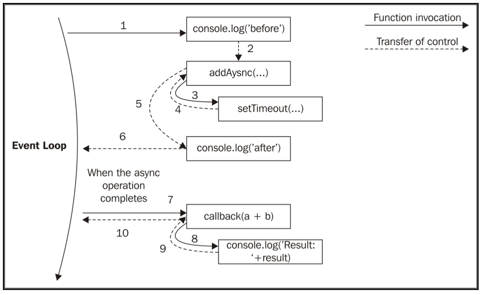

# Chapter 2: Node.js Essential Patterns
本章介绍了Node最核心的两种设计模式-`回调(callback)`与`事件触发器(eventemitter)`;

## 回调模式
回调模式是实现Reactor模式的实现，也是Node独特变成风格的印记。  
在本节中，我们分析基于回调的编程思想和模式，而不是同步操作的返回指令的模式。  

### CPS(Continuation Passing Style)
在JavaScript中，回调函数作为参数传递给另一个函数，并在操作完成时调用。在函数式编程中，这种传递结果的方法被称为CPS。这是一个通用的概念，它并不总是与异步操作相关联，事实上它只表示通过将结果传递给另一个函数(函数)而使结果得到传递，而不是直接返回给调用者。
#### 同步CPS与异步CPS
同步：
```js
//这是一个同步的add函数
function add(a,b){
    return a+b;
}
//这是一个等效后的CPS函数
function add(a,b,callback){
    callback(a+b);
}
//这是对该CPS的调用
console.log('before');
add(1,2,ans = > console.log('result:'+ ans));
console.log('after');
```
因为add()函数是同步的，所以结果如下：
```
before
result:3
after
```
我们分析一下程序运行的流程，首先输出before，然后传递`1,2`给匿名回调函数`ans()`，等待`ans()`计算完成再退栈到`add()`,最后输出after，非常传统的流程。
OK接下来我们看一下异步CPS是怎样的
```js
//使用setTimeout()模拟回调的异步调用
function addAsync(a,b,callback){
  setTimeout(()=>callback(a+b),100);
}
```
输出结果
```
before
after
result:3
```
由于setTimeout()触发了异步操作，它不会等待需要执行的回调而是立刻返回执行后面的语句，也就是说回到addAsync()，然后再返回到主程序中，所以`before`与`after`会先于`result:3`被输出。  
看起来这个回调好像是和主线程并行执行的，如果我们把setTimeout()中的数字改小一些呢？  
答案是没有用的，Reactor模式虽然能实现“看起来是并行”的效果，但是本质还是在串行执行，而callback的内容是由时间循环来执行的，下面这张图解释来程序的执行过程：

当异步操作完成时，执行权就会交给这个异步操作开始的地方，即回调函数。执行将从*事件循环*开始，所以它将有一个新的堆栈。对于JavaScript而言，这是它的优势所在。正是由于闭包保存了其上下文环境，即使在不同的时间点和不同的位置调用回调，也能够正常地执行。

同步函数在其完成操作之前是阻塞的。而异步函数立即返回，结果将在事件循环的稍后循环中传递给处理程序（在我们的例子中是一个回调）。

#### 非CPS回调
某些情况下情况下，我们可能会认为回调CPS式的写法像是异步的，然而并不是。比如以下代码，`Array`对象的`map()`方法：
```js
const result = [1, 5, 7].map(element => element - 1);
console.log(result); // [0, 4, 6]
```
在上述例子中，回调仅用于迭代数组的元素，而不是传递操作的结果。实际上，这个例子中是使用回调的方式同步返回，而非传递结果。是否是传递操作结果的回调通常在API文档有明确说明。
### 同步还是异步
同步/异步编程模式不同会对代码产生不同的影响，体现在开发/调试的各个阶段。下面我们分析一下不同模式所带来的陷阱。
#### 不可预测的函数
```js
const fs = require('fs');
const cache = {};

function inconsistentRead(filename, callback) {
  if (cache[filename]) {
    // 如果缓存命中，则同步执行回调
    callback(cache[filename]);
  } else {
    // 未命中，则执行异步非阻塞的I/O操作
    fs.readFile(filename, 'utf8', (err, data) => {
      cache[filename] = data;
      callback(data);
    });
  }
}
```
这段代码中，同一个API既有可能在同步模式下运行，也有可能在一步模式下运行。  
这个函数是危险的，因为如果没有设置高速缓存，它的行为是异步的，直到`fs.readFile()`函数返回结果为止，它都不会同步执行，这时缓存并不会触发，而会去走异步回调调用。
#### 解放[Zalgo](https://github.com/oren/oren.github.io/blob/master/posts/zalgo.md)
关于`zalgo`，其实就是指同步或异步行为的不确定性，几乎总是导致非常难追踪的`bug`。
举个例子：
```js
function createFileReader(filename) {
  const listeners = [];
  inconsistentRead(filename, value => {
    listeners.forEach(listener => listener(value));
  });
  return {
    onDataReady: listener => listeners.push(listener)
  };
}
```
这段代码使用了前文中的inconsistentRead()实现了createFileReader()，接下来我们尝试使用createFileReader()函数
```js
const reader1 = createFileReader('data.txt');
reader1.onDataReady(data => {
 console.log('First call data: ' + data);
 // 之后再次通过fs读取同一个文件
 const reader2 = createFileReader('data.txt');
 reader2.onDataReady(data => {
   console.log('Second call data: ' + data);
 });
});
```
我们把所有代码保存在一个文件中，并在同目录创建一个`data.txt`的文件，文件中只有一句`hello world`，然后我们执行`node main.js`，获得如下结果：
```bash
$ node main.js
First call data: hello
```
所以为什么只有一次调用，第二次去哪儿了？  
* 在创建`reader1`的时候，`inconsistentRead()`函数是异步执行的，这时没有可用的缓存结果，因此我们有时间注册事件监听器。在读操作完成后，它将在下一次事件循环中被调用。
* 然后，在事件循环的循环中创建`reader2`，其中所请求文件的缓存已经存在。在这种情况下，内部调用`inconsistentRead()`将是同步的。所以，它的回调将被立即调用，这意味着`reader2`的所有监听器也将被同步调用。然而，在创建`reader2`之后，我们才开始注册监听器，所以它们将永远不被调用。
* `inconsistentRead()`回调函数的行为是不可预测的，因为它取决于许多因素，例如调用的频率，作为参数传递的文件名，以及加载文件所花费的时间等。
#### 使用同步API
通过上述示例，我们得到一个结论：  
> API必须明确定义其特性-同步或者异步  
必须正确评估应用场景，选择最合适的I/O方案  
注意，只有不影响程序并发能力时，才考虑使用同步阻塞I/O  
#### 延迟执行
是一种解决上面代码问题的手段，可以使`inconsistentRead()`函数变成完全异步的
```js
if (cache[filename]) {
    // 如果缓存命中，则同步执行回调
    callback(cache[filename]);
  }
/////////////////////////////
if (cache[filename]) {
    // 下一次事件循环立即调用
    process.nextTick(() => callback(cache[filename]));
  }
```

### Node.js回调约定
在Node中，CPS的API和回调遵守一组特定的约定，我们在编写API时也应遵守。
* 回调函数是最后一个参数
* 异常处理放在最前面
* 异常传递到下一个回调
* 收到未捕获异常退出程序

## 模块系统及模式

