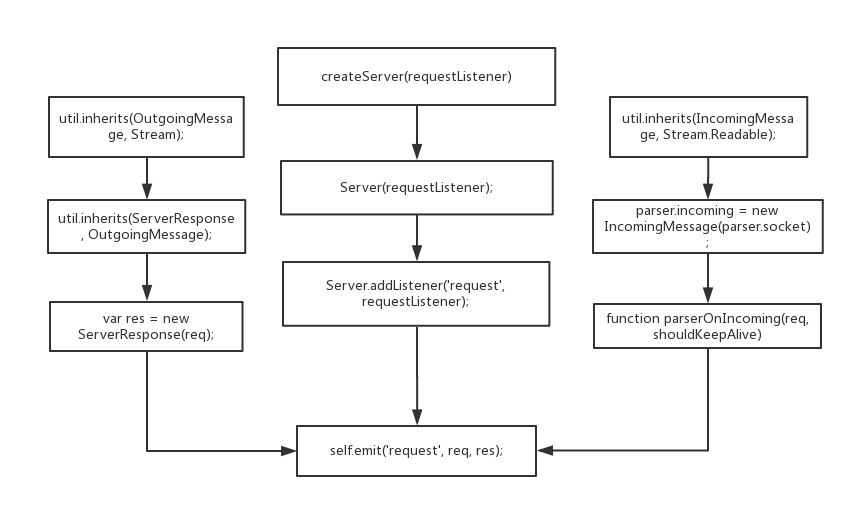
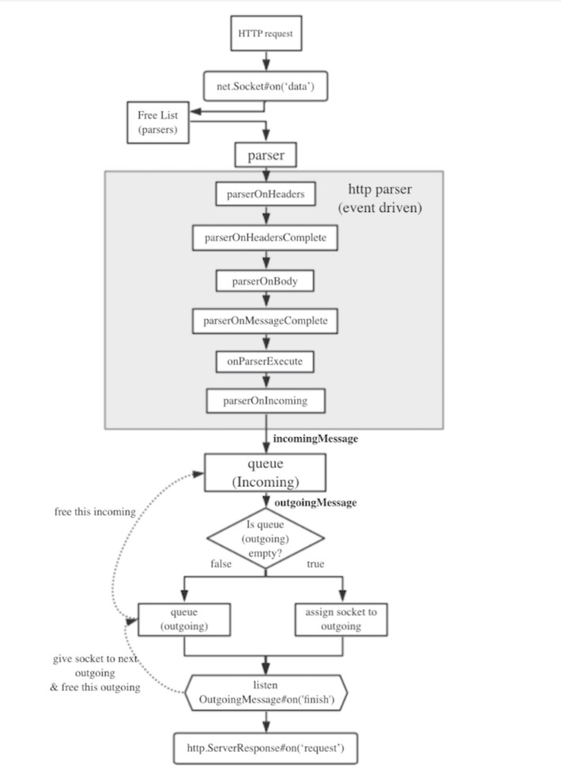

# 一个典型的Node-http-hello world源码:
```js
var http = require('http');
http.createServer(function(req,res){
    res.writeHead(200,{'Content-Type':'text/plain'});
    res.write('hello world');
    res.end();
}).listen(3000);
```
这段代码主要做了以下几件事情：  
- 引入了`http`模块实例化了`http`对象
- 执行`createServer()`对象，并根据传入的回调函数实例化一个http服务器对象
    - *匿名回调的内容*
    - 当有请求到达时，调用`writeHead`方法发送200应答头
    - 答复正文`hello world`
    - 调用`end()`方法，完成这次请求，关闭连接
- 调用`listen()`方法绑定端口，使服务器开始监听

我们首先需要了解一下`createServer()`对象

# createServer()
在`http.js`文件中可以找到该对象，该方法被使用exports进行暴露
```js
exports.createServer = function(requestListener) {
  return new Server(requestListener);
};
```
可以看到，`createServer()`对象实例化的过程其实是传递一个`requestListener`回调函数给了实例化的新的`Server()`对象，并返回了这个`Server()`对象  
那么`Server()`对象来自哪里?  
```js
exports._connectionListener = server._connectionListener;
var Server = exports.Server = server.Server;
```
Server继承net.Server
## Server()
继续追踪
```js
`_http_server.js`
function Server(requestListener) {
  if (!(this instanceof Server)) return new Server(requestListener);
  net.Server.call(this, { allowHalfOpen: true });

  if (requestListener) {
    this.addListener('request', requestListener);
  }

  // Similar option to this. Too lazy to write my own docs.
  // http://www.squid-cache.org/Doc/config/half_closed_clients/
  // http://wiki.squid-cache.org/SquidFaq/InnerWorkings#What_is_a_half-closed_filedescriptor.3F
  this.httpAllowHalfOpen = false;

  this.addListener('connection', connectionListener);

  this.addListener('clientError', function(err, conn) {
    conn.destroy(err);
  });

  this.timeout = 2 * 60 * 1000;
}

```
可以看到，Server()是继承自`net.Server()`，Server()构造期间，首先判断当前对象是否已经是一个Server()的实例，如果是那么就构造一个新的对象；然后进行一些配置，最后把`requestListener`绑定到了实例的`'request'`事件上，并为`'clientError'`事件绑定了处理函数

## `'request'`事件
我们基本可以推断，当有`'request'`事件触发时，我们编写的匿名回调函数就会被触发调用，继续追踪触发`'request'`事件的场景  
OK酷炫，看我们找到了什么 
```js
function parserOnIncoming(req, shouldKeepAlive) {
    incoming.push(req);

    // If the writable end isn't consuming, then stop reading
    // so that we don't become overwhelmed by a flood of
    // pipelined requests that may never be resolved.
    if (!socket._paused) {
      var needPause = socket._writableState.needDrain;
      if (needPause) {
        socket._paused = true;
        // We also need to pause the parser, but don't do that until after
        // the call to execute, because we may still be processing the last
        // chunk.
        socket.pause();
      }
    }

    var res = new ServerResponse(req);

    res.shouldKeepAlive = shouldKeepAlive;
    DTRACE_HTTP_SERVER_REQUEST(req, socket);
    COUNTER_HTTP_SERVER_REQUEST();

    if (socket._httpMessage) {
      // There are already pending outgoing res, append.
      outgoing.push(res);
    } else {
      res.assignSocket(socket);
    }

    // When we're finished writing the response, check if this is the last
    // respose, if so destroy the socket.
    res.on('prefinish', resOnFinish);
    function resOnFinish() {
      // Usually the first incoming element should be our request.  it may
      // be that in the case abortIncoming() was called that the incoming
      // array will be empty.
      assert(incoming.length === 0 || incoming[0] === req);

      incoming.shift();

      // if the user never called req.read(), and didn't pipe() or
      // .resume() or .on('data'), then we call req._dump() so that the
      // bytes will be pulled off the wire.
      if (!req._consuming && !req._readableState.resumeScheduled)
        req._dump();

      res.detachSocket(socket);

      if (res._last) {
        socket.destroySoon();
      } else {
        // start sending the next message
        var m = outgoing.shift();
        if (m) {
          m.assignSocket(socket);
        }
      }
    }

    if (!util.isUndefined(req.headers.expect) &&
        (req.httpVersionMajor == 1 && req.httpVersionMinor == 1) &&
        continueExpression.test(req.headers['expect'])) {
      res._expect_continue = true;
      if (EventEmitter.listenerCount(self, 'checkContinue') > 0) {
        self.emit('checkContinue', req, res);
      } else {
        res.writeContinue();
        self.emit('request', req, res);
      }
    } else {
      self.emit('request', req, res);
    }
    return false; // Not a HEAD response. (Not even a response!)
}
```
`parserOnIncoming()`是`parser.onIncoming`的一个方法，在这个方法中，对于同一个 `socket` 发来的请求，源码中分别维护了两个队列，用于缓冲` IncomingMessage` 实例和对应的 `ServerResponse` 实例。先来的 `ServerResponse` 实例先占用 `socket` ，监听其 `finish` 事件，从各自队列中释放该 `ServerResponse` 实例和对应的 `IncomingMessage` 实例。
那么当`request`事件触发时，req和res 是如何生成的呢？

## res(Response)
我们很容易找到了这样一组语句：
```js
var res = new ServerResponse(req);
```
`ServerResponse(req)`是在文件大概100行的一个函数
```js
function ServerResponse(req) {
  OutgoingMessage.call(this);

  if (req.method === 'HEAD') this._hasBody = false;

  this.sendDate = true;

  if (req.httpVersionMajor < 1 || req.httpVersionMinor < 1) {
    this.useChunkedEncodingByDefault = chunkExpression.test(req.headers.te);
    this.shouldKeepAlive = false;
  }
}
util.inherits(ServerResponse, OutgoingMessage);
......
exports.ServerResponse = ServerResponse;
```
继续追踪`OutgoingMessage`
```js
//_http_server.js
var OutgoingMessage = require('_http_outgoing').OutgoingMessage;
//_http_outgoing.js
function OutgoingMessage() {
  Stream.call(this);

  this.output = [];
  this.outputEncodings = [];
  this.outputCallbacks = [];

  this.writable = true;

  this._last = false;
  this.chunkedEncoding = false;
  this.shouldKeepAlive = true;
  this.useChunkedEncodingByDefault = true;
  this.sendDate = false;
  this._removedHeader = {};

  this._hasBody = true;
  this._trailer = '';

  this.finished = false;
  this._hangupClose = false;
  this._headerSent = false;

  this.socket = null;
  this.connection = null;
  this._header = null;
  this._headers = null;
  this._headerNames = {};
}
util.inherits(OutgoingMessage, Stream);
exports.OutgoingMessage = OutgoingMessage;
```
原来是一个Stream对象

## req(Request)
我们再来看req参数，req参数在前文的函数中是作为一个被传入后调用的参数出现的
```js
function parserOnIncoming(req, shouldKeepAlive) {
//......
}
```
继续追踪
```js
//parserOnIncoming;
parser.onIncoming = parserOnIncoming;
//parser
var parser = parsers.alloc();
//parsers
var common = require('_http_common');
var parsers = common.parsers;
//_http_common.js
//parsers
//onIncoming
skipBody = parser.onIncoming(parser.incoming, info.shouldKeepAlive);
//parser.incoming
parser.incoming = new IncomingMessage(parser.socket);
//IncomingMessage
const incoming = require('_http_incoming');
const IncomingMessage = incoming.IncomingMessage;
//_http_incoming.js
util.inherits(IncomingMessage, Stream.Readable);
exports.IncomingMessage = IncomingMessage;
```
`parser.incoming`就是前文中传入的`req`，它是一个`IncomingMessage`对象，继承自`Stream`对象。

整个流程可用下图表示


# listen()
`createServer()`完成后需要为Server绑定端口，我们继续追踪一下`listen()`是如何执行的
```js
function Server(requestListener) {
  if (!(this instanceof Server)) return new Server(requestListener);
  net.Server.call(this, { allowHalfOpen: true });

  if (requestListener) {
    this.addListener('request', requestListener);
  }

  // Similar option to this. Too lazy to write my own docs.
  // http://www.squid-cache.org/Doc/config/half_closed_clients/
  // http://wiki.squid-cache.org/SquidFaq/InnerWorkings#What_is_a_half-closed_filedescriptor.3F
  this.httpAllowHalfOpen = false;

  this.addListener('connection', connectionListener);

  this.addListener('clientError', function(err, conn) {
    conn.destroy(err);
  });

  this.timeout = 2 * 60 * 1000;
}
util.inherits(Server, net.Server);
//////
function connenctListener(socket){
//......
     function　parseronIncoming(req,shouldKeepAlive){
//          ......
              将request事件发送给监听器
//          ......
     }
//......
}
```
`Server`对象是继承自`net.Server`的
```js
function onconnection(err, clientHandle) {
//......
     self.emit('connection', socket);     
}
Server.prototype._listen2 = function(address, port, addressType, backlog, fd) {
//......
     this._handle.onconnection = onconnection;
//......    
}
function listen(self, address, port, addressType, backlog, fd, exclusive) {
//......
      self._listen2(address, port, addressType, backlog, fd);
//......
}
Server.prototype.listen = function()
```
追到这里其实已经很深了，结论显而易见：  
`http_server`是继承自net的一个对象，基于`Socket`操作实现`http`服务器的功能。  


因此，我们在编写http服务器程序时，可以参考这个结构，下面我们开始自己写一个简单的http服务器程序。


# 编写一个简单的HTTP服务器
```js
```


