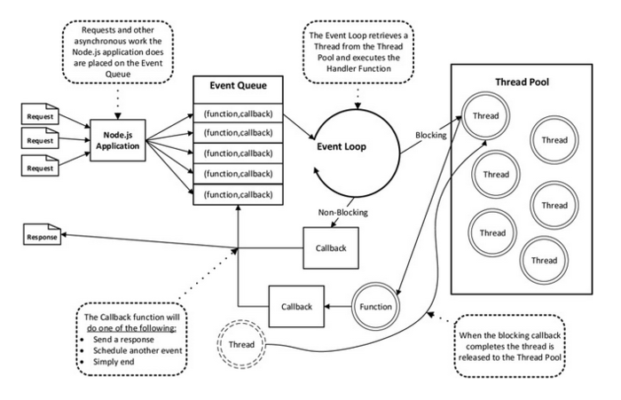

# 目录

1. [一个http server sample](#一个http-server-sample)
2. [npm的介绍与使用方法](#npm)
3. [Node.JS的回调函数](#Node.js的回调函数)
4. [EventEmitter类的介绍](#Node.js_EventEmitter)
5. [Node.js的单线程异步原理](#Node.js的单线程异步原理)
6. [Node.js的Buffer类](#Node.js-Buffer类)
7. [Node.js的Stream对象](#Node.js的Stream对象)
8. [Node.js的模块机制](#NodeJS的模块)
9. [Node.js的函数机制](#NodeJS的函数)
10. [Node.js的网络编程](#Node的网络编程)
    - [TCP-Socket](#TCP-Socket)
    - [UDP-SOCKET](#UDP-SOCKET)
    - [WebSocket](#NodeJSWebSocket)
11. [Node.js的路由](#NodeJS的路由)


# 一个http-server-sample

[返回目录](#本文目录)  

```js
var http = require('http');

http.createServer(function (request, response) {

    // 发送 HTTP 头部 
    // HTTP 状态值: 200 : OK
    // 内容类型: text/plain
    response.writeHead(200, {'Content-Type': 'text/plain'});

    // 发送响应数据 "Hello World"
    response.end('Hello World\n');
}).listen(8888);

// 终端打印如下信息
console.log('Server running at http://127.0.0.1:8888/');
```

# npm
[返回目录](#目录)  
NPM是随同NodeJS一起安装的包管理工具，类似pip  
使用方法：`sudo npm install <package> -g`
-g代表`global`，非全局安装不需要  
查看某个模块版本号的命令:`npm list grunt`  
卸载某个模块的命令:`npm uninstall <package>`  
查看包列表的命令:`npm ls`  
更新模块的命令:`npm update <package>`  
搜索模块的命令:`npm search <package>`  
生成`package.json`文件的命令:`npm init`  
发布新模块的命令:略  

# Node.js的回调函数
### [返回目录](#目录)
Node.JS的异步编程直接体现就是回调  
阻塞代码示例：
```js
var fs = require("fs");
var data = fs.readFileSync('input.txt');
console.log(data.toString());
console.log("程序执行结束!");
```
> 在该代码段中，程序阻塞读取input.txt，直到读取完成之前不会执行下一句语句。  

非阻塞异步代码示例：
```js
var fs = require("fs");
fs.readFile('input.txt', function (err, data) {
    if (err) return console.error(err);
    console.log(data.toString());
});
console.log("程序执行结束!");
```
> 在该代码段中，程序异步读取input.txt，将读取操作交由线程池中的活动线程去执行，主线程先执行  
```js
console.log('程序执行结束');
```
语句，待读取结束后执行匿名回调函数，输出文件内容。
# Node.js_EventEmitter
### [返回目录](#目录)
EventEmitter模块示例：
```js
var events = require('events');
var eventEmitter = new events.EventEmitter();
// 监听器 #1
var listener1 = function listener1() {
   console.log('监听器 listener1 执行。');
}
// 监听器 #2
var listener2 = function listener2() {
  console.log('监听器 listener2 执行。');
}
// 绑定 connection 事件，处理函数为 listener1 
eventEmitter.addListener('connection', listener1);
// 绑定 connection 事件，处理函数为 listener2
eventEmitter.on('connection', listener2);
var eventListeners = require('events').EventEmitter.listenerCount(eventEmitter,'connection');
console.log(eventListeners + " 个监听器监听连接事件。");
// 处理 connection 事件 
eventEmitter.emit('connection');
// 移除监绑定的 listener1 函数
eventEmitter.removeListener('connection', listener1);
console.log("listener1 不再受监听。");
// 触发连接事件
eventEmitter.emit('connection');
eventListeners = require('events').EventEmitter.listenerCount(eventEmitter,'connection');
console.log(eventListeners + " 个监听器监听连接事件。");
console.log("程序执行完毕。");
```
执行结果：
```bash
$ node main.js
2 个监听器监听连接事件。
监听器 listener1 执行。
监听器 listener2 执行。
listener1 不再受监听。
监听器 listener2 执行。
1 个监听器监听连接事件。
程序执行完毕。
```
`EvenEmitter.on()`与`EvenEmitter.addListener()`并没有区别。
EventEmitter方法表:  
方法名|描述
---|---
addListener(event,listener)|为指定事件添加一个监听器到监听器队列的尾部
on(event,listener)|为指定事件添加一个监听器到监听器队列的尾部
once(event,listener)|为指定事件注册一个单次监听器
removeListener([event])|移除[指定]事件的监听器,缺省移除所有事件的监听器
setMaxListeners(n)|指定监听器数量,通常监听器大于等于10时会发出警告
listeners(event)|返回监听器队列
emit(event,[arg1],[arg2]...)|触发事件，如果规定了监听器的触发顺序则按指定顺序触发
listenerCount(emitter, event)|返回指定事件的监听器数量

# Node.js的单线程异步原理
### [返回目录](#目录)


1. Nodejs与操作系统交互，我们在 Javascript 中调用的方法，最终都会通过 process.binding 传递到 C/C++ 层面，最终由他们来执行真正的操作。Node.js 即这样与操作系统进行互动。  
2. nodejs所谓的单线程，只是主线程是单线程，所有的网络请求或者异步任务都交给了内部的线程池去实现，本身只负责不断的往返调度，由事件循环不断驱动事件执行。  
3. Nodejs之所以单线程可以处理高并发的原因，得益于libuv层的事件循环机制，和底层线程池实现。  
4. Event loop就是主线程从主线程的事件队列里面不停循环的读取事件，驱动了所有的异步回调函数的执行，Event loop总共7个阶段，每个阶段都有一个任务队列，当所有阶段被顺序执行一次后，event loop 完成了一个 tick。  

# Node.js-Buffer类
### [返回目录](#目录)
JavaScript 语言自身只有字符串数据类型，没有二进制数据类型。  
在 Node.js 中，Buffer 类是随 Node 内核一起发布的核心库。Buffer 库为 Node.js 带来了一种存储原始数据的方法，可以让 Node.js 处理二进制数据，每当需要在 Node.js 中处理I/O操作中移动的数据时，就有可能使用 Buffer 库。
```js
new Buffer(size)
//实例化一个size大小的，单位为8位字节的Buffer
//Buffer可通过另一个Buffer/string来进行构造
Buffer.from(value/string/list)
//从给定的value实例化一个buffer
Buffer.length
//返回这个Buffer对象的bytes数
Buffer.write(string,[offset,[length],encoding])
根据offset偏移量和指定的encoding方式，将string数据写入Buffer，所有参数可缺省
Buffer.write[rwtype][LE/BE](value,offset,byteLength,[noAssert])
//将value写入Buffer里，由offset和byteLength决定，noAssert为true时不验证value与offset有效性
Buffer.read[rwtype][LE/BE](offset,byteLength,[noAssert])
//按offset，byteLength从Buffer中读取数据
//LE/BE代表小端对齐/大端对齐
/* rwtype表
UInt    -48位以下无符号数字
Int     -48位以下有符号数字
Float   -32位浮点数
Double  -64位浮点数
UInt8   -8位无符号整数
UInt16  -16位无符号整数
UInt32  -32位无符号整数
Int8    -8位有符号整数
Int16   -16位有符号整数
Int32   -32位有符号整数
*/
Buffer.toString([encoding,[start,end]])
//根据指定的编码类型(默认'utf8')返回解码过的string类型
Buffer.toJSON()
//将Buffer转化为JSON对象
Buffer[index]
//获取或设置指定的字节。
Buffer.concat(list[totalLength])
//合并若干个Buffer，返回合并后的结果
Buffer.equals(otherBuffer)
//比较两个缓冲区是否相等
Buffer.compare(otherBuffer)
//比较两个Buffer，返回第一个不同字节出现的位置
Buffer.copy(targetBuffer,[targetStart,[sourceStart,sourceEnd]])
//从sourceBuffer的偏移量targetBuffer开始拷贝指定长度数据
Buffer.slice([start,end])
//剪切Buffer对象，负索引代表从尾部开始计算
Buffer.fill(value,[offset,end])
//使用指定value填充这个Buffer
```

# Node.js的Stream对象

### [返回目录](#目录)

Stream是一个抽象接口，Node中有很多对象实现了这个接口。  
例如，对Http服务器发起的request请求，就是一个Stream;stdin/stdout也都是Stream。  
NodeJS有4种流类型：  
- Readable  -   可读操作
- Writeable -   可写操作
- Duplex    -   可读可写操作
- Transform -   操作被写入数据，然后读出结果

所有的Stream对象都是EventEmitter的实例，常用的事件有：
- data  -   当数据可读时触发
- end   -   当没有更多数据可读时触发
- error -   读写过程中出错触发
- finish-   所有数据被写入完成时触发

流操作例程：
```js
//读取流
var fs = require("fs");
var data = '';
// 创建可读流
var readerStream = fs.createReadStream('input.txt');
// 设置编码为 utf8。
readerStream.setEncoding('UTF8');
// 处理流事件 --> data, end, and error
readerStream.on('data', function(chunk) {
   data += chunk;
});
readerStream.on('end',function(){
   console.log(data);
});
readerStream.on('error', function(err){
   console.log(err.stack);
});
console.log("程序执行完毕");

var fs = require("fs");
var data = '菜鸟教程官网地址：www.runoob.com';
//================================//
//写入流
// 创建一个可以写入的流，写入到文件 output.txt 中
var writerStream = fs.createWriteStream('output.txt');

// 使用 utf8 编码写入数据
writerStream.write(data,'UTF8');

// 标记文件末尾
writerStream.end();

// 处理流事件 --> data, end, and error
writerStream.on('finish', function() {
    console.log("写入完成。");
});

writerStream.on('error', function(err){
   console.log(err.stack);
});
console.log("程序执行完毕");
//================================//
//管道流
var fs = require("fs");
// 创建一个可读流
var readerStream = fs.createReadStream('input.txt');
// 创建一个可写流
var writerStream = fs.createWriteStream('output.txt');
// 管道读写操作
// 读取 input.txt 文件内容，并将内容写入到 output.txt 文件中
readerStream.pipe(writerStream);
console.log("程序执行完毕");
//================================//
//链式流
//链式是通过连接输出流到另外一个流并创建多个流操作链的机制。链式流一般用于管道操作。
var fs = require("fs");
var zlib = require('zlib');
// 压缩 input.txt 文件为 input.txt.gz
fs.createReadStream('input.txt')
  .pipe(zlib.createGzip())
  .pipe(fs.createWriteStream('input.txt.gz'));
console.log("文件压缩完成。");


var fs = require("fs");
var zlib = require('zlib');
// 解压 input.txt.gz 文件为 input.txt
fs.createReadStream('input.txt.gz')
  .pipe(zlib.createGunzip())
  .pipe(fs.createWriteStream('input.txt'));
console.log("文件解压完成。");

```
# NodeJS的模块

### [返回目录](#目录)
为了让NodeJS的文件可以相互调用，NodeJS提供了一个简单的模块系统。  
模块是Node.js 应用程序的基本组成部分，文件和模块是一一对应的。换言之，一个 Node.js 文件就是一个模块，这个文件可能是JavaScript 代码、JSON 或者编译过的C/C++ 扩展。    
Node.js 提供了 exports 和 require 两个对象，其中 exports 是模块公开的接口，require 用于从外部获取一个模块的接口，即所获取模块的 exports 对象。  
示例代码
```js
//======hello.js======//
exports.world = function() {
  console.log('Hello World');
}
//======main.js======//
var hello = require('./hello');
hello.world();
```

以上export对象还可以如下封装与调用：  
```js
//hello.js 
function Hello() { 
    var name; 
    this.setName = function(thyName) { 
        name = thyName; 
    }; 
    this.sayHello = function() { 
        console.log('Hello ' + name); 
    }; 
}; 
module.exports = Hello;
//main.js 
var Hello = require('./hello'); 
hello = new Hello(); 
hello.setName('BYVoid'); 
hello.sayHello(); 
```
# NodeJS的函数

### [返回目录](#目录)
在JS中，一个函数可以作为另一个函数的参数。我们可以先定义一个函数，然后传递，也可以直接在传参的地方定义匿名函数。  
例如:
```js
function execute(someFunction, value) {
    someFunction(value);
}
function say(word) {
    console.log(word);
}
execute(say, "Hello");
execute(function(word){ 
    console.log(word) 
    }, "Hello");
```

# Node的网络编程

## TCP-Socket

构建TCP服务的例程：
```js
//Server.js
"use strict";
var net = require('net');
var server = net.createServer(function(socket){
	socket.on('data',function(data){
		console.log('client say: '+data.toString());
		socket.write('hello !');
	});
	socket.on('end',function(){
		console.log('connection end');
	});
	socket.write('now you are connected');
});
var port = 9000;
try{
	server.listen(port,function(){
		console.log('server bound');
	});
}catch(err){
	console.log('an exception occured');
	console.log(err);
};
//client.js
"use strict";
var net = require('net');
var s_port = 9000;
var client = net.connect({port:s_port},function(){
    console.log('client connected to localhost:'+s_port.toString());
    client.write('hello, I\'m client!');
});
client.on('data',function(data){
    console.log('server say: '+data.toString());
    client.end();
});
client.on('end',function(){
    console.log('client disconnected');
});
```
TCP服务有如下几种事件：  
- 服务器事件:
    - `listening`:在调用`server.listen()`后触发，简洁写法是`server.listen(port,listeningListener)`
    - `connection`:在每个客户端套接字连接到服务器时触发
    - `close`:当服务器关闭时触发
    - `error`:当服务器发生异常时触发
- 连接事件
    - `data`:当接收到数据时触发
    - `end`:当接收到FIN数据时触发
    - `connect`:客户端事件，连接成功时触发
    - `drain`:发送数据时触发
    - `error`:异常发生时触发
    - `close`:套接字完全关闭时触发
    - `timeout`:套接字一段时间不活跃后触发

另外，因为TCP套接字对象可以是Stream对象，所以可以利用pipe()方法巧妙地实现管道操作
```js
//利用pipe实现echo服务器
var net = require('net');
var socket = net.createServer(function(socket){
    socket.write('Echo server connected\r\n');
    socket.pipe(socket);
});
socket.listen(9000,'127.0.0.1');
```
## UDP-SOCKET
UDP与TCP相比使用起来简单一些，只要调用`dgram.bind(port,[address])`方法就可以对网卡和端口进行绑定。  
例程如下:  
```js
//udpserver.js
var dgram = require('dgram');
var server = dgram.createSocket("udp4");
server.on("message",function(msg,rinfo){
    console.log("server got: "+msg+" from "+rinfo.address+":"+rinfo.port);
});
server.on('listening',function(){ 
    var address = server.address();
    console.log("server listening "+address.address+":"+address.port);
});
server.bind(11111);
//udpclient.js
var dgram = require('dgram');
var message = new Buffer.from("this is a udp message!\r\n");
var client = dgram.createSocket("udp4");
client.send(message,0,message.length,11111,"localhost",function(err,bytes){
    client.close();
});
```
UDP的事件与TCP相比更简单，主要有以下事件:  
- `message`:收到数据包后触发该事件，触发携带的数据为一个消息buffer对象和一个远程地址信息
- `listening`:UDP套接字开始侦听时触发该事件
- `close`:调用close()方法时触发该事件，触发后不再触发`message`事件
- `error`:出现异常时触发该事件，如果不侦听程序会直接退出

## NodeJSWebSocket

HTML5推出了WebSocket标准，可以使浏览器和服务器之间建立无限制的全双工通信，用处极大；而Node对WebSocket的配合也堪称完美。引用自书中原话:  
> - WebSocket客户端基于事件的编程模型与Node中自定义事件相差无几。  
> - WebSocket实现了客户端与服务器之间的长连接，而Node事件驱动的方式十分擅长与大量的客户保持高并发连接。  
> - 客户端与服务器端只建立一个TCP连接，可以使用更少的连接
> - WebSocket服务器端可以推送数据给客户端，远比http请求响应模式更高效灵活
> - 更轻量级的协议头，减少数据传输量

### WebSocket的握手过程

WebSocket的握手部分是由HTTP完成的，因此十分有迷惑性，客户端建立连接的报文如下:
```http
GET /chat HTTP/1.1
Host: server.example.com
Upgrade: websocket
Connection: Upgrade
Sec-WebSocket-Key: dGhlIHNhbXBsZSBub25jZQ==
Origin: http://example.com
Sec-WebSocket-Protocol: chat, superchat
Sec-WebSocket-Version: 13
```


# NodeJS的路由
### [返回目录](#目录)
路由可以理解为解析URL请求和其他的POST/GET请求，并提取数据执行相应代码的模块。  
一个典型的解析过程如下:
```
                   url.parse(string).query
                                           |
           url.parse(string).pathname      |
                       |                   |
                       |                   |
                     ------ -------------------
http://localhost:8888/start?foo=bar&hello=world
                                ---       -----
                                 |          |
                                 |          |
              querystring.parse(queryString)["foo"]    |
                                            |
                         querystring.parse(queryString)["hello"]
```

